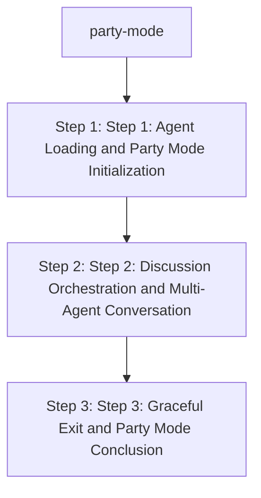

# party-mode
Orchestrates group discussions between all installed Aegis agents, enabling natural multi-agent conversations

```mermaid
flowchart TD
  party_mode["party-mode"]
  step_1_step_01_agent_loading_md["Step 1: Step 1: Agent Loading and Party Mode Initialization"]
  step_2_step_02_discussion_orchestration_md["Step 2: Step 2: Discussion Orchestration and Multi-Agent Conversation"]
  step_3_step_03_graceful_exit_md["Step 3: Step 3: Graceful Exit and Party Mode Conclusion"]
  party_mode --> step_1_step_01_agent_loading_md
  step_1_step_01_agent_loading_md --> step_2_step_02_discussion_orchestration_md
  step_2_step_02_discussion_orchestration_md --> step_3_step_03_graceful_exit_md
```
Source: core/workflows/party-mode/workflow.md