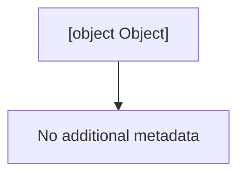

# [object Object]
[object Object]

```mermaid
flowchart TD
  _object_Object_["[object Object]"]
  _object_Object__details["No additional metadata"]
  _object_Object_ --> _object_Object__details
```
Source: builder/docs/workflows/templates/workflow.md