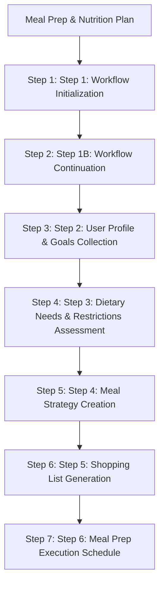

# Meal Prep & Nutrition Plan
Creates personalized meal plans through collaborative nutrition planning between an expert facilitator and individual seeking to improve their nutrition habits.

Source: builder/reference/workflows/meal-prep-nutrition/workflow.md