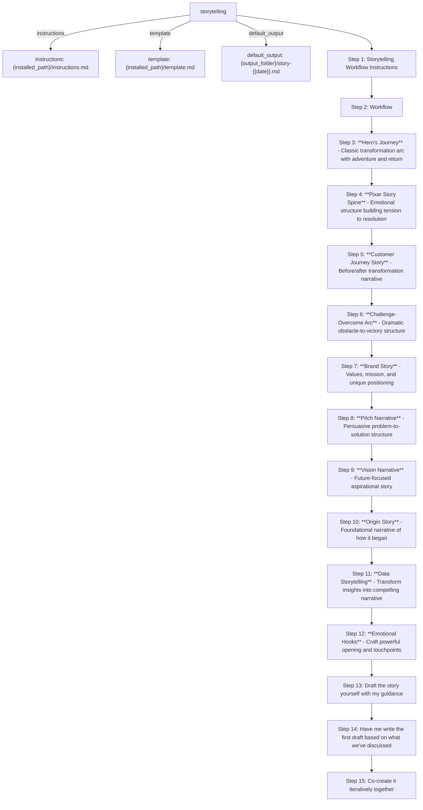

# storytelling
Craft compelling narratives using proven story frameworks and techniques. This workflow guides users through structured narrative development  applying appropriate story frameworks to create emotionally resonant and engaging stories for any purpose.

Source: cis/workflows/storytelling/workflow.yaml