# workflow-status
Lightweight status checker - answers "what should I do now?" for any agent. Reads YAML status file for workflow tracking. Use workflow-init for new projects.

```mermaid
flowchart TD
  workflow_status["workflow-status"]
  instructions__installed_path__instructions_md["instructions: {installed_path}/instructions.md"]
  template__installed_path__workflow_status_templa["template: {installed_path}/workflow-status-template.yaml"]
  path_files__installed_path__paths_["path_files: {installed_path}/paths/"]
  default_output__output_folder__bmm_workflow_stat["default_output: {output_folder}/bmm-workflow-status.yaml"]
  step_1_instructions_md["Step 1: Workflow Status Check - Multi-Mode Service"]
  step_2_instructions_md["Step 2: 📊 Current Status"]
  step_3_instructions_md["Step 3: 🎯 Next Steps"]
  step_4_instructions_md["Step 4: **Start next workflow** - {{next_workflow_name}} ({{next_agent}})"]
  step_5_instructions_md["Step 5: **Run optional workflow** - Choose from available options"]
  step_6_instructions_md["Step 6: **View full status YAML** - See complete status file"]
  step_7_instructions_md["Step 7: **Update workflow status** - Mark a workflow as completed or skipped"]
  step_8_instructions_md["Step 8: **Exit** - Return to agent"]
  step_9_instructions_md["Step 9: Mark a workflow as **completed** (provide file path)"]
  step_10_instructions_md["Step 10: Mark a workflow as **skipped**"]
  workflow_status -->|instructions| instructions__installed_path__instructions_md
  workflow_status -->|template| template__installed_path__workflow_status_templa
  workflow_status -->|path_files| path_files__installed_path__paths_
  workflow_status -->|default_output| default_output__output_folder__bmm_workflow_stat
  workflow_status --> step_1_instructions_md
  step_1_instructions_md --> step_2_instructions_md
  step_2_instructions_md --> step_3_instructions_md
  step_3_instructions_md --> step_4_instructions_md
  step_4_instructions_md --> step_5_instructions_md
  step_5_instructions_md --> step_6_instructions_md
  step_6_instructions_md --> step_7_instructions_md
  step_7_instructions_md --> step_8_instructions_md
  step_8_instructions_md --> step_9_instructions_md
  step_9_instructions_md --> step_10_instructions_md
```

Source: method/workflows/workflow-status/workflow.yaml